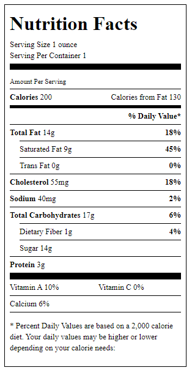

## Example

```typescript
const ChococlateChipCookie = {
    items: [
        { amount: 14, nutritionItem: ENutritionItem.Fat },
        { amount: 9, nutritionItem: ENutritionItem.SaturatedFat },
        { amount: 0, nutritionItem: ENutritionItem.TransFat },
        { amount: 55, nutritionItem: ENutritionItem.Cholesterol },
        { amount: 40, nutritionItem: ENutritionItem.Sodium },
        { amount: 17, nutritionItem: ENutritionItem.TotalCarb },
        { amount: 1, nutritionItem: ENutritionItem.DietaryFiber },
        { amount: 14, nutritionItem: ENutritionItem.Sugar },
        { amount: 3, nutritionItem: ENutritionItem.Protein },
        { amount: 1, nutritionItem: ENutritionItem.VitaminA, fractionOverride: 0.1 },
        { amount: 1, nutritionItem: ENutritionItem.VitaminC, fractionOverride: 0  },
        { amount: 0, nutritionItem: ENutritionItem.Calcium, fractionOverride: 0.06 }

    ],
    calories: 200,
    caloriesFromFat: 130
}


const ChococlateChipCookieServing = {
    imperialUnits: ImperialUnits.Ounce,
    fractionalSize: "1",
    servingNumber: 1
} as IServingSize;

const props = {
    servingSizeInformation: ChococlateChipCookieServing,
    nutritionItems: ChococlateChipCookie
}


ReactDOM.render(<NutritionFactTable {...props}/>, document.getElementById('root'))
```


